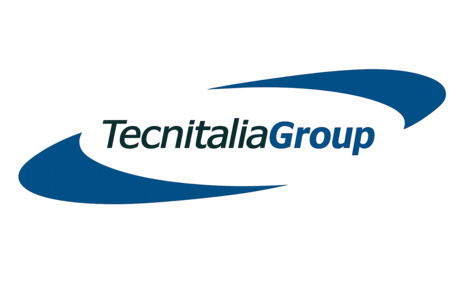

<p align="center">
  
</p>

<h1 align="center">Tecnitalia Group</h1>
<p align="center"><b>Ingegneria & Ambiente • Jamstack Architecture</b></p>

<p align="center">
  
  
  
  
  
  
</p>

---

## 🧭 Navigazione Rapida
* [Core Concept](#-core-concept) • [Caratteristiche Principali](#-caratteristiche-principali-features) • [Tech Stack Matrix](#%EF%B8%8F-tech-stack-matrix) • [Architettura File System](#-architettura-file-system) • [Analisi del Core Engine](#-analisi-del-core-engine-mainjs) • [Modelli Dati (JSON Database)](#-modelli-dati-json-database) • [SEO e Dati Strutturati](#-seo-e-dati-strutturati) • [Sicurezza e Privacy](#-sicurezza-e-privacy) • [Analytics](#-analytics) • [Setup Locale](#-setup-locale-e-sviluppo) • [Configurazione EmailJS](#-configurazione-del-form-di-contatto-emailjs)

---

## ⚡ Core Concept

Il portale di **Tecnitalia Group** è un'applicazione web ad alte prestazioni ingegnerizzata secondo i paradigmi del **Modern Jamstack**. Il sistema adotta un modello di rendering disaccoppiato (*decoupled UI*): la struttura scheletrica è immutabile e statica, mentre le aree ad alto aggiornamento (News e Progetti) vengono idratate asincronamente a runtime manipolando direttamente il DOM tramite pipeline JavaScript natie. 

> [!TIP]
> Questo approccio azzera la necessità di un database relazionale (SQL) sul server, annullando i costi di hosting, riducendo alcune superfici di attacco tipiche delle applicazioni server-side (niente database da violare, niente codice backend da sfruttare) e garantendo un punteggio di *Core Web Vitals* vicino al 100%. Essere statici non equivale però a essere sicuri: restano rilevanti la configurazione della CSP, l'integrità delle librerie di terze parti e le pratiche di igiene del repository — vedi la sezione [Sicurezza e Privacy](#-sicurezza-e-privacy).

---

## 🚀 Caratteristiche Principali (Features)

- **Architettura a Componenti Modulari:** L'intestazione (`header.html`) e il piè di pagina (`footer.html`) sono file isolati e indipendenti, iniettati dinamicamente nel DOM per garantire il principio DRY (*Don't Repeat Yourself*).
- **Data-Driven UI (JSON Database):** Le sezioni "News" e "Progetti" non sono scritte a mano nell'HTML. Vengono popolate dinamicamente leggendo array di oggetti da file JSON (`.json`), agendo come un database statico locale.
- **Pipeline Asincrona Parallela:** Sfrutta `Promise.all` per caricare contemporaneamente layout e dati, minimizzando i tempi di caricamento strutturale (Time to Interactive).
- **Routing Dinamico per News:** Il sistema legge i parametri URL query (`?id=...`) tramite `URLSearchParams` per generare dinamicamente le pagine di dettaglio del singolo articolo (`news-singola.html`) da un unico file matrice.
- **Sistema di Filtraggio Avanzato:** I progetti possono essere filtrati in tempo reale sul client in base ai tag di competenza senza ricaricare la pagina.
- **Ordinamento Automatico:** I progetti vengono riordinati programmaticamente lato client dal più recente al più vecchio basandosi sull'anno di completamento (`endYear`).
- **Esperienza Visiva Premium:**
  - *Fluid Scrolling:* Integrazione con *Lenis Smooth Scroll* per uno scorrimento morbido e cinematico.
  - *Scroll-Driven Animations:* Animazioni fluide guidate dallo scorrimento tramite *GSAP* e *ScrollTrigger*.
  - *Modal Gallery Slider:* Finestra modale interattiva per i dettagli dei progetti, dotata di slider interno per scorrere le immagini e blocco temporaneo dello smooth-scroll sullo sfondo (`lenis.stop() / lenis.start()`) per ottimizzare la UX.
- **Integrazione SMTP Client-Side:** Modulo di contatto integrato nativamente con l'SDK di **EmailJS** per l'invio di email direttamente dal client tramite API, completo di gestioni di caricamento (*loading state*) e validazione dei feedback visivi (successo/errore). La sicurezza è demandata a un'allow-list di dominio lato pannello EmailJS — vedi [Configurazione del Form di Contatto](#-configurazione-del-form-di-contatto-emailjs).
- **Librerie Self-Hosted:** GSAP, ScrollTrigger, Lenis ed EmailJS non sono più caricate da CDN esterni ma servite direttamente da `assets/vendor/`, eliminando il rischio supply-chain e le connessioni esterne al caricamento pagina — vedi [Architettura File System](#-architettura-file-system).

---

## 🛠️ Tech Stack Matrix

| Tecnologia / Libreria | Ambito di Applicazione | Impatto sulla UX / Performance |
| :--- | :--- | :--- |
| **HTML5 & CSS3** | Struttura & Design System | Layout responsivo fluido basato su CSS Custom Properties (Variabili). |
| **Vanilla ES6+** | Core Logic & Routing | Idratazione dati asincrona parallela tramite `Promise.all` senza framework pesanti. |
| **GSAP & ScrollTrigger** | Motion Design | Animazioni guidate dallo scorrimento riallineate dinamicamente al caricamento dati. Self-hosted (`assets/vendor/`), v3.12.2. |
| **Lenis Scroll** | Smooth Layout Interaction | Scorrimento cinematico fluido e controllo degli eventi inerziali. Self-hosted (`assets/vendor/`), v1.0.29. |
| **EmailJS Browser SDK** | Serverless SMTP Tunneling | Invio form client-side via API. La chiave (`publicKey`) è un identificativo pubblico che compare in chiaro nel JavaScript servito, non una credenziale segreta: la protezione ideale sarebbe l'allow-list del dominio, che però richiede un piano a pagamento; in uso c'è il campo honeypot del form (vedi `docs/sicurezza.md`). Self-hosted (`assets/vendor/`), @emailjs/browser v4. |
| **JSON Schema** | Flat-File Database | Strutturazione dei contenuti in array di oggetti indicizzati e facilmente scalabili. |

---

## 📁 Architettura File System

Il codice segue una suddivisione rigorosa e modulare per separare la logica computazionale dagli asset statici e dai file strutturali:

```text
├── assets/
│   ├── img/                              # Immagini del team, progetti, background e favicon
│   └── vendor/                           # Librerie di terze parti self-hosted (non da CDN)
│       ├── gsap.min.js                   # GSAP 3.12.2 (da cdnjs)
│       ├── ScrollTrigger.min.js          # ScrollTrigger 3.12.2 (da cdnjs)
│       ├── lenis.min.js                  # Lenis 1.0.29 (da jsdelivr, gh/studio-freight/lenis)
│       └── emailjs.min.js                # @emailjs/browser v4 (da jsdelivr)
├── css/
│   └── style.css                         # Foglio di stile globale (Layout, Variabili e Responsive)
├── tools/
│   └── genera-news.py           # Genera le pagine news statiche e la sitemap
├── data/                                 # I "Database" JSON del sito
│   ├── news.json                         # Archivio dati degli articoli e aggiornamenti
│   └── projects.json                     # Archivio dati di tutti i progetti eseguiti
├── docs/                                 # Documentazione interna (esclusa da Pages via _config.yml, ma visibile nel repo pubblico)
│   ├── checklist-visibilita.md
│   ├── sicurezza.md            # Analisi di sicurezza: verifiche svolte e rischi aperti
│   ├── stato-progetto.md       # Stato dei lavori, interventi aperti e decisioni prese
│   ├── linkedin-about.txt
│   ├── linkedin-prompts.md
│   ├── linkedin-specialties.txt
│   ├── linkedin-tagline.txt
│   └── superpowers/                      # Piani e specifiche del redesign (plans/, specs/)
├── js/
│   └── main.js                           # Controller logico globale del sito (Core Engine)
├── archivio-news.html                    # Pagina contenente l'elenco completo degli articoli
├── bonifica-amianto.html                 # Pagina servizio: bonifica e censimento amianto
├── bonifica-siti-contaminati.html        # Pagina servizio: bonifica di siti contaminati
├── caratterizzazione-analisi-rischio.html# Pagina servizio: caratterizzazione e analisi di rischio
├── chi-siamo.html                        # Pagina della storia e della vision aziendale
├── demolizioni-decommissioning.html      # Pagina servizio: demolizioni e decommissioning
├── dettaglio-ingegneria.html             # Pagina hub della divisione Ingegneria, raccoglie le 4 pagine servizio
├── dettaglio-servizi.html                # Pagina di approfondimento divisione Servizi / Laboratorio
├── elenco-progetti.html                  # Portfolio completo dei progetti con filtri interattivi
├── footer.html                           # Componente parziale del Piè di pagina (Senza HEAD/BODY)
├── header.html                           # Componente parziale della Barra di Navigazione (Senza HEAD/BODY)
├── index.html                            # Landing page principale (Home Page)
├── news-<slug>.html            # Pagine articolo GENERATE (non modificare a mano)
├── news-singola.html                     # Template matrice per il dettaglio del singolo articolo
├── privacy.html                          # Informativa privacy GDPR (`noindex`)
├── CNAME                                 # Dominio custom per GitHub Pages (tracciato in git)
├── llms.txt                              # Descrizione del sito per assistenti AI
├── robots.txt                            # Direttive crawler, inclusi crawler AI (GPTBot, ClaudeBot, ecc.)
├── sitemap.xml                           # Sitemap con 11 URL e data di ultimo aggiornamento
├── .gitignore                            # Esclude documenti di lavoro, credenziali e file locali dal repo pubblico
├── Istruzioni dns.md                     # Note operative sulla configurazione DNS (dominio su OVH)
└── README.md                             # Questo file di documentazione
```

---

## 🧠 Analisi del Core Engine (`main.js`)

Il file `js/main.js` funge da orchestratore centralizzato dell'applicazione e si sviluppa su 4 fasi cardine:

1. **Il Ciclo di Vita `DOMContentLoaded`:** All'avvio, viene inizializzato un ciclo `Promise.all` che esegue le richieste di rete `fetch` asincrone contemporaneamente anziché in modo sequenziale, eliminando i colli di bottiglia.
2. **Iniezione dei Componenti:** Una volta scaricati `header.html` e `footer.html`, il software individua nel DOM i selettori id `#nav-placeholder` e `#footer-placeholder` e vi inietta le stringhe HTML corrispondenti.
3. **Inizializzazione dei Servizi condizionati:** Subito dopo l'iniezione, viene invocata la funzione `inizializzaEmailJS()` che aggancia il listener sull'evento `submit` del form (che ora esiste nel DOM, prevenendo errori di riferimento).
4. **Rendering Dinamico & GSAP Patch:** 
> [!IMPORTANT]  
> **Il GSAP Patch Meccanismo:** Poiché GSAP calcola le posizioni degli elementi per le animazioni all'avvio del file, l'inserimento di dati asincroni (come le card dei progetti) altererebbe le altezze effettive della pagina sfalsando i trigger. Per risolvere questo problema, il codice implementa un meccanismo di riallineamento geometrico ritardato:
> ```javascript
> setTimeout(() => {
>     if (typeof ScrollTrigger !== 'undefined') {
>         ScrollTrigger.refresh(); // Forza ScrollTrigger a ricalcolare le geometrie del DOM
>     }
> }, 150);
> ```

---

## 📊 Modelli Dati (JSON Database)

Per aggiungere, rimuovere o modificare elementi all'interno del sito, non serve toccare i file HTML. Basta editare i file strutturati all'interno della cartella `/data/`.

<details>
<summary>📰 Clicca per espandere il Modello e lo Schema di <code>news.json</code></summary>

```json
[
  {
    "id": "nuove-direttive-terre",
    "titolo": "Nuove direttive Terre e Rocce da Scavo",
    "data": "14 Maggio 2026",
    "immagine": "./assets/img/news-terre.jpg",
    "riassunto": "Aggiornamento sulle recenti modifiche normative per la gestione...",
    "contenuto": "<p>Testo esteso dell'articolo. Supporta tag HTML come <strong>grassetti</strong> o paragrafi multipli.</p>"
  }
]
```
</details>

<details>
<summary>📦 Clicca per espandere il Modello e lo Schema di <code>projects.json</code></summary>

```json
[
  {
    "title": "Bonifica Area Industriale Ex-Fiat",
    "client": "Ente Sviluppo Urbano S.p.A.",
    "period": "2024 - 2026",
    "endYear": 2026,
    "val": "€ 1.200.000",
    "type": "Ingegneria Ambientale / Bonifiche",
    "cardSubtitle": "Caratterizzazione e messa in sicurezza permanente dei terreni.",
    "desc": "<p>Descrizione estesa visibile solo all'interno del pop-up modale...</p>",
    "images": [
      "./assets/img/progetto1-cover.jpg",
      "./assets/img/progetto1-dettaglio.jpg"
    ],
    "tags": ["bonifiche", "ingegneria"]
  }
]
```
</details>

---

## 🔎 SEO e Dati Strutturati

### Pagine news generate

Gli articoli vivono in `data/news.json`. Poiché il sito li caricava via JavaScript su
`news-singola.html?id=N`, tutti condividevano un solo URL e nessuno poteva essere indicizzato
singolarmente. Lo script `tools/genera-news.py` risolve il problema producendo una pagina statica
per articolo, con il contenuto già presente nell'HTML servito, JSON-LD `NewsArticle`,
`datePublished` e canonical propri.

Lo stesso script riscrive `sitemap.xml` e rigenera il blocco delle ultime news in `index.html`,
delimitato dai marcatori `<!-- NEWS-HOME:INIZIO -->` e `<!-- NEWS-HOME:FINE -->`: è contenuto di
ripiego che il JavaScript sostituisce, ma che i crawler leggono, e senza rigenerazione automatica
invecchierebbe a ogni pubblicazione.

```bash
python tools/genera-news.py
```

Va rieseguito dopo ogni modifica a `data/news.json`, e il risultato va committato. Le pagine sono
generate piatte nella root e non in una sottocartella, perché `js/main.js` usa percorsi relativi
(`fetch('./header.html')`) che in una sottocartella darebbero 404.

`news-singola.html` resta pubblicata per i vecchi link `?id=N`, ma è marcata `noindex` per non
competere con le pagine generate.

- **JSON-LD:** 11 delle 12 pagine HTML del sito (tutte tranne `privacy.html`) includono blocchi `<script type="application/ld+json">` nel `<head>` con schema.org — `ProfessionalService`, `Service`, `FAQPage` e `BreadcrumbList` a seconda della pagina — per favorire i rich result nei motori di ricerca.
- **Sitemap e canonical:** `sitemap.xml` elenca gli 11 URL indicizzabili con `<lastmod>`. La home usa un canonical su `/` (non su `/index.html`).
- **`robots.txt` e crawler AI:** oltre alle direttive standard, il file autorizza esplicitamente i crawler dei sistemi di AI generativa (GPTBot, ClaudeBot, Claude-User, OAI-SearchBot, ChatGPT-User, PerplexityBot, Google-Extended, Applebot-Extended, CCBot) a leggere e citare i contenuti tecnici del sito.
- **`llms.txt`:** file in root, pensato per essere letto dagli assistenti AI, che riassume chi è Tecnitalia Group, le aree di competenza e i riferimenti di contatto.
- **Fallback statico nei placeholder (progressive enhancement):** `js/main.js` inietta `header.html` e `footer.html` via `innerHTML` dentro `#nav-placeholder` e `#footer-placeholder` (vedi [Analisi del Core Engine](#-analisi-del-core-engine-mainjs)). In precedenza questi due `<div>` erano vuoti nell'HTML servito: un crawler che non esegue JavaScript, o che legge solo la prima risposta HTML, non trovava mai il menu di navigazione né l'indirizzo e il telefono in `<address>`. Ora entrambi i placeholder contengono già nel markup un contenuto statico equivalente (link di navigazione in `#nav-placeholder`, indirizzo/telefono/email in `#footer-placeholder`), che `main.js` sostituisce a runtime non appena `header.html`/`footer.html` sono disponibili. L'utente non vede alcuna duplicazione visiva (il contenuto dinamico rimpiazza quello statico prima che l'occhio se ne accorga), ma un crawler che legge solo l'HTML iniziale trova comunque l'informazione strutturale del sito.

---

## 🔐 Sicurezza e Privacy

- **Content-Security-Policy (CSP):** presente come tag `<meta http-equiv="Content-Security-Policy">` su tutte le 12 pagine HTML, non come header HTTP — GitHub Pages non permette di impostare header personalizzati lato server. La policy limita gli script e gli stili ammessi a `'self'` più i domini strettamente necessari (`static.cloudflareinsights.com`, `fonts.googleapis.com`/`fonts.gstatic.com`, `api.emailjs.com`).
  > [!NOTE]
  > **Limite dichiarato della CSP:** la policy include `'unsafe-inline'` sia per `script-src` sia per `style-src`, perché il codice attuale usa diffusamente attributi `style="..."` inline e alcuni handler `onclick` generati da `js/main.js` (ad es. sui bottoni della modale progetti). Questo significa che la protezione contro XSS è **parziale**: uno script iniettato tramite un attributo inline non verrebbe bloccato dalla CSP. Per stringere la policy (rimuovendo `'unsafe-inline'`) servirebbe un refactor che sposti stili e handler verso classi CSS ed event delegation in `main.js`.
- **`Referrer-Policy`:** anch'essa via tag `<meta name="referrer" content="strict-origin-when-cross-origin">`, per lo stesso vincolo di GitHub Pages sugli header HTTP.
- **Librerie self-hosted invece che da CDN:** GSAP, ScrollTrigger, Lenis ed EmailJS sono servite da `assets/vendor/` invece che da cdnjs/jsdelivr. Il motivo concreto: Lenis veniva caricata da un percorso GitHub mutabile su jsdelivr (`gh/studio-freight/lenis@1.0.29`), che chi controlla quel repository upstream può in teoria modificare — un rischio supply-chain che avrebbe permesso l'esecuzione di codice arbitrario sul sito. Il self-host elimina questo rischio e riduce a zero le connessioni esterne necessarie al caricamento delle librerie.
  > [!NOTE]
  > **Contropartita da tenere presente:** `assets/vendor/` non è gestita da un file manifest (es. `package.json`), quindi Dependabot e il controllo vulnerabilità automatico di GitHub non la vedono. Gli aggiornamenti di queste librerie sono manuali: chi aggiorna deve ricontrollare le versioni sopra (GSAP/ScrollTrigger 3.12.2, Lenis 1.0.29, @emailjs/browser v4) e riscaricarle dalla fonte originale.
- **Nessuna dipendenza esterna da `via.placeholder.com`:** rimossa.
- **`CNAME` tracciato in git:** il dominio custom per GitHub Pages è ora versionato nel repository invece di essere impostato solo lato pannello GitHub.
- **Privacy:** `privacy.html` è l'informativa GDPR del sito, marcata `noindex` per non comparire nei risultati di ricerca.

---

## 📈 Analytics

Il sito usa **Cloudflare Web Analytics** tramite un beacon JavaScript (`static.cloudflareinsights.com/beacon.min.js`), incluso nel `<head>` delle pagine e autorizzato dalla CSP tramite `connect-src`/`script-src`. È un analytics **senza cookie e senza banner di consenso**: non serve migrare il DNS su Cloudflare, che resta su OVH — il beacon funziona indipendentemente da chi gestisce il DNS del dominio.

---

## 💻 Setup Locale e Sviluppo

> [!WARNING]  
> **Blocco di Sicurezza del Browser (CORS):** A causa delle politiche di sicurezza dei browser moderni (*Cross-Origin Resource Sharing*), **non è possibile** aprire il file `index.html` facendo semplicemente doppio clic sopra. Le chiamate `fetch` verso i file JSON locali e i componenti HTML fallirebbero lanciando un errore di sicurezza. È obbligatorio simulare un ambiente server.

> [!WARNING]
> **Il form di contatto funziona anche da `localhost`.** L'allow-list dei domini di EmailJS richiede un piano a pagamento e non è attiva: gli invii di prova in locale recapitano quindi messaggi reali alla casella aziendale, perciò conviene usare testi riconoscibili. Se un domani l'allow-list venisse attivata, gli invii da `localhost` inizieranno a fallire, e sarà il comportamento atteso.

### Opzione A: Tramite VS Code (Consigliata)
1. Installa l'estensione **Live Server** di Ritwick Dey.
2. Apri la cartella del progetto in VS Code.
3. Seleziona il file `index.html`.
4. Clicca sul pulsante **Go Live** in basso a destra sulla barra di stato.

### Opzione B: Tramite Terminale (Python)
Se hai Python installato sul tuo sistema (Windows/Mac/Linux), apri il terminale o la PowerShell all'interno della cartella del progetto ed esegui:
```bash
python -m http.server 8000
```
Dopodiché apri il browser e naviga all'indirizzo `http://localhost:8000`.

### Opzione C: Tramite Node.js
Se usi l'ambiente Node, puoi lanciare un server istantaneo senza installare pacchetti globali:
```bash
npx live-server
```

---

## ✉️ Configurazione del Form di Contatto (EmailJS)

Il modulo di contatto è interamente integrato e pre-configurato client-side nel file `main.js`. Se desideri collegarlo al tuo account personale per ricevere le email reali:

1. Registrati sul sito ufficiale di [EmailJS](https://www.emailjs.com/).
2. Collega un servizio email (ad esempio la tua casella Gmail aziendale).
3. Crea un *Email Template* inserendo i parametri corrispondenti ai campi strutturati nel form (`name`, `email`, e `message`).
4. Apri il file `js/main.js`, individua la funzione `inizializzaEmailJS()` e sostituisci le credenziali con i tuoi identificativi personali:

```javascript
function inizializzaEmailJS() {
    if (typeof emailjs === 'undefined') return;

    emailjs.init({
        publicKey: "IL_TUO_PUBLIC_KEY_REALE", // Inserisci qui la tua Public Key
    });

    // ... codice intermedio ...

    // Sostituisci i primi due argomenti con il tuo Service ID e il tuo Template ID:
    emailjs.sendForm('ID_SERVIZIO_SMTP', 'ID_TEMPLATE_EMAILJS', form)
}
```

5. **Protezione della chiave pubblica.** L'allow-list dei domini (Account -> Security -> Domains) limiterebbe l'uso della chiave al solo dominio di produzione, ma **richiede un piano a pagamento**: nel piano gratuito il salvataggio restituisce l'errore "Subscription Limitation". La protezione in uso è quindi il campo honeypot `website` presente nel form. Il rischio residuo è stato valutato e accettato consapevolmente: vedi `docs/sicurezza.md`. Se l'allow-list verrà attivata, il valore da inserire è `https://www.tecnitaliagroup.it` - non l'apex, che reindirizza a `www` e non è mai l'origine reale delle richieste.

---
*Documentazione tecnica ad alta fedeltà aggiornata al 30 Agosto 2026 per l'infrastruttura web di Tecnitalia Group.*